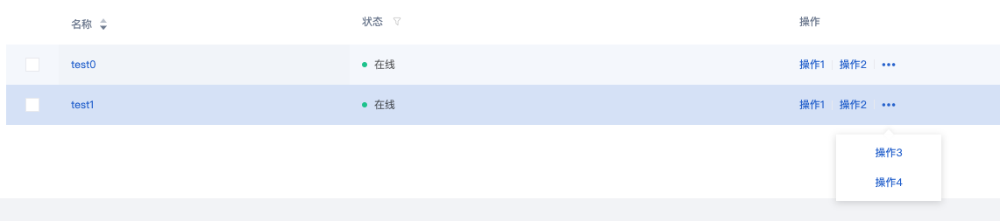
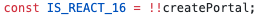

# React 升级踩坑记——Popover-Portals-Click

项目升级的路说难也不难，但是遇到的每个问题还是值得去探索研究的，今天我就来和大家分享一此探索经历。

## 场景描述

下图是我的一个项目场景，标准的 Antd Table，亮点在于操作栏，我们把不常用的操作通过 Popover 的方式隐藏在了省略号当中，当然我还支持整行的点击，去选中某一行进行操作。



我简单的还原了一下当时的场景： https://github.com/caohuilin/Portal-Example/blob/master/src/table.tsx

## 问题分析

在 Popover 没有设置 getPopupContainer 时，其 content 会挂载在 body 上面，当然 content 上的点击事件不会影响 onRow 上的 click 事件。但是神奇的是，升级之后 onRow 的 click 事件居然可以接收到 content 上的点击事件，你可以运行上面代码试试。
好奇的我想一探究竟，果断去翻源码，Popover -> Tooltip -> rc-tooltip -> rc-trigger，终于翻到了一行:

 
 
源码中通过是否支持 createPortal 来判断 React 版本是不是 16，再到代码深处，在此判断的基础上分别使用的是 rc-util 中两个组件，一个是 Portal，一个是 ContainerRender 来实现的。

- Protal，使用 ReactDOM.createPortal 实现的， 源码链接：https://github.com/react-component/util/blob/master/src/Portal.js。

- ContainerRender，使用 ReactDOM.unstable_renderSubtreeIntoContainer 实现的，源码链接：https://github.com/react-component/util/blob/master/src/ContainerRender.js

这应该就是这个问问题的核心，接下来详细给大家介绍一下两者的区别。

### unstable_renderSubtreeIntoContainer

这个 API 是 React 的隐藏 API，没有实现复杂组件库的需求确实是用不到的。其实组件库中有很多弹出组件，比如 Modal、Tooltip、Select 等等，它们的弹出层都不在当前的 dom 树中，以确保弹出层的位置不被遮挡，但是它们也需要和当前的 dom 树进行通信，展示，隐藏、事件等等，这个函数就是实现了两棵不相干的 dom 树之间通过 context 连接起来，从而实现了弹出层的需求。

### createPortal

createPortal 是 React16 提供的解决上述问题的官方解决方案，使用方法如下，很轻松的就可以实现将子元素挂载在一个特定的 dom 上面，同样可以使用 context 进行通信。

```
render() {
  return ReactDOM.createPortal(
    this.props.children,
    domNode
  );
}
```

## Click

为什么要讲点击事件呢，是因为 Portal 除了上述问题，还特殊处理了事件冒泡。虽然子元素已经脱离了父组件，但是事件仍可以通过事件冒泡的机制传给父组件，这就是开头那个问题的原因所在。
这样的解决方案确实可以进一步的将虚拟 dom 和真实 dom 统一了起来，逻辑上的 dom 关系都具有了冒泡机制。但在我的这个场景下，确实是个坑，解决方法当然很简单，stopPropagation 就可以了。
